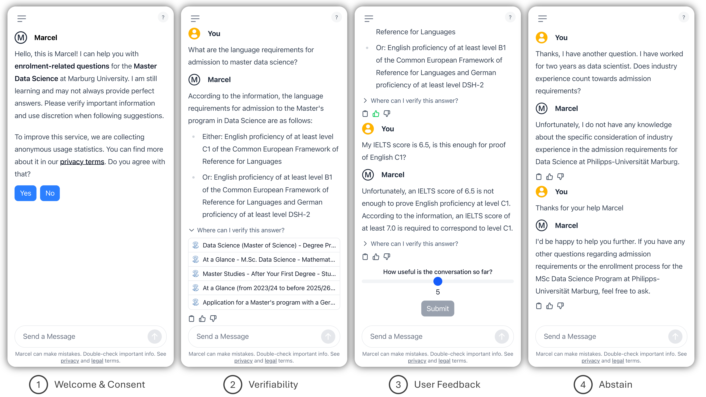
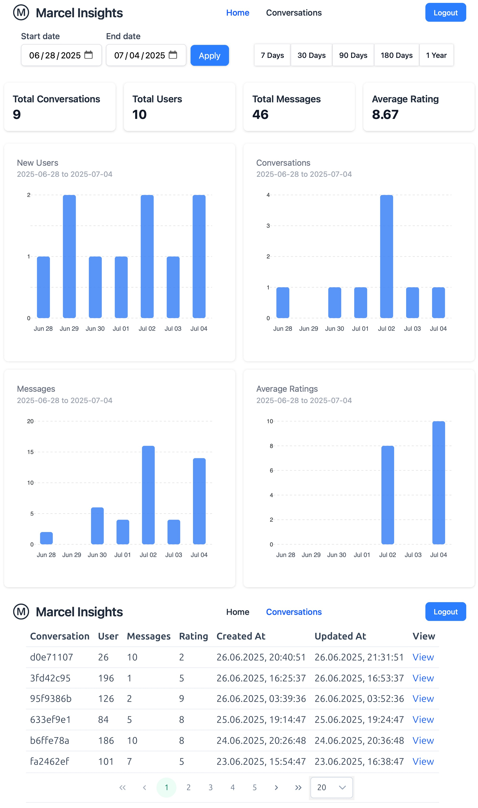

<p align="center">
  
</p>

---

Marcel is a lightweight, open-source conversational agent designed to support prospective students with admission-related inquiries. It aims to provide fast and personalized responses while reducing the workload of university support staff. The system is engineered for easy deployment in resource-constrained academic settings.

**More information:** [Paper](https://aclanthology.org/2025.emnlp-demos.13/) | [Demo video](https://youtu.be/uLCB2R6szz4)

This repository provides the application related code. For experiments related to the EMNLP paper, please refer to the [`marcel-emnlp-experiments`](https://github.com/aix-group/marcel-emnlp-experiments) repository.

## Quickstart

### Clone repository

```sh
git clone git@github.com:aix-group/marcel-chat.git
```

### Configure environment

Create a `.env` file based on the template and set the required variables.

```sh
cp .env.example .env
vi .env # Please refer to the .env file for configuration options
```
### Data
Simplified data is available in the [data folder](./data/)

The **knowledge base** defines the set of RAG sources used for your task. It must be a strictly valid and well-formatted .jsonl file. Each entry is a JSON object and must contain the following keys:
```url```,  ```content```, ```favicon``` and 

```og```: Metadata extracted via the Open Graph Protocol. This field is a dictionary and typically includes following keys:
  - ```og:title```: Title of the page
  - ```og:description```: Short description of the page
  - ```og:type```: Type of the object (e.g., "website", "article")
  - ```og:url```: Canonical URL (should match or normalize url)
  - ```og:image```: Image URL used for preview
  - ```og:image:type```: MIME type of the preview image

```og``` can also be an empty dictionary.
<details>
<summary><b>Knowledge base Example</b></summary>

```json
{
    "url": "https://www.uni-marburg.de/en/studying/after-your-first-degree/masters-programs/application-for-a-masters-programme/master",
    "content": "# Master\n\n  \n\n\n\n\n",
    "og": {
        "og:site_name": "Philipps-Universit\u00e4t Marburg",
        "og:title": "Master",
        "og:type": "website",
        "og:description": "",
        "og:url": "https://www.uni-marburg.de/en/studying/after-your-first-degree/masters-programs/application-for-a-masters-programme/master",
        "og:image": "https://www.uni-marburg.de/@@site-logo/favicon.ico",
        "og:image:type": "image/x-icon"
    },
    "favicon": "https://www.uni-marburg.de/++theme++plonetheme.unimr/layout/favicon.ico"
}
```

</details>
<br>

If you like to use an **FAQ retriever**, you can build the **FAQ**. It must be a well-formatted ```.json``` file. Each object represents a single entry and must include the following keys: ```id```, ```question``` and ```sources```
<details>
<summary> <b>FAQ Example</b> </summary>

```json
[
  {
        "id": "faq-0001",
        "question": "Does the Master Data Science have a minimum grade requirement?",
        "sources": [
            "https://www.uni-marburg.de/en/studying/after-your-first-degree/masters-programs/degree-programs/datasciencems",
            "https://www.uni-marburg.de/en/studying/after-your-first-degree/masters-programs/application-for-a-masters-programme/eap/eap-data-science"
        ]
    }
]
```

</details>
<br>


Plese refer to [backend instruction](./backend/README.md) for ```admins``` configuration
<details>
<summary><b>Admins Example</b></summary>

```json
[
    {
        "username": "admin",
        "hashed_password": "$argon2id$v=19$m=65536,t=3,p=4$FRnc99KQkJkRK+1RkTueyg$WbJ64c5iyXgHDy3nJyGqpEAyc1VsM8Q63ocF4XMRTF8"
    }
]

```
</details>


### Generate certificates

The application supports HTTPs-encrypted traffic. For development purposes, you can generate certificates like this:

```sh
mkdir certs
cd certs
openssl req -x509 -nodes -days 365 \
  -newkey rsa:2048 \
  -keyout selfsigned.key \
  -out  selfsigned.crt \
  -subj "/CN=localhost"
sudo chmod +r selfsigned.crt
sudo chmod +r selfsigned.key
```

### Start Containers
```sh
docker compose --env-file .env up
```
The app will be available at: https://localhost:8080/

## Development instructions
Refer to the following documents:

- [Backend](./backend/README.md)
- [Frontend](./frontend/README.md)
- [Scraper](./scraper/README.md)
- **Docker Deployment:** [Docker](./docs/docker.md)

## User Interface


1. Welcome and Consent: Displayed on first use to inform and obtain user agreement.

2. Source Attribution: For answerable queries, Marcel displays the list of source documents used.

3. Feedback Mechanism: Users can rate individual responses (thumbs up/down). After three interactions, they can rate the overall conversation.

4. Answer Limitation: Marcel abstains from answering questions not supported by the underlying knowledge base.

## Admin Interface


  **Top**: A dashboard shows key
usage statistics over a customizable time period. 
\
  **Bottom**: List of conversations with links for manual review.

## Citation

If you found any of these resources useful in your work, please consider citing our paper:

```bibtex
@inproceedings{trienes-etal-2025-marcel,
    title = "Marcel: A Lightweight and Open-Source Conversational Agent for University Student Support",
    author = {Trienes, Jan  and
      Derzhanskaia, Anastasiia  and
      Schwarzkopf, Roland  and
      M{\"u}hling, Markus  and
      Schl{\"o}tterer, J{\"o}rg  and
      Seifert, Christin},
    editor = {Habernal, Ivan  and
      Schulam, Peter  and
      Tiedemann, J{\"o}rg},
    booktitle = "Proceedings of the 2025 Conference on Empirical Methods in Natural Language Processing: System Demonstrations",
    month = nov,
    year = "2025",
    address = "Suzhou, China",
    publisher = "Association for Computational Linguistics",
    url = "https://aclanthology.org/2025.emnlp-demos.13/",
    doi = "10.18653/v1/2025.emnlp-demos.13",
    pages = "181--195",
    ISBN = "979-8-89176-334-0",
    abstract = "We present Marcel, a lightweight and open-source conversational agent designed to support prospective students with admission-related inquiries. The system aims to provide fast and personalized responses, while reducing workload of university staff. We employ retrieval-augmented generation to ground answers in university resources and to provide users with verifiable, contextually relevant information. We introduce a Frequently Asked Question (FAQ) retriever that maps user questions to knowledge-base entries, which allows administrators to steer retrieval, and improves over standard dense/hybrid retrieval strategies. The system is engineered for easy deployment in resource-constrained academic settings. We detail the system architecture, provide a technical evaluation of its components, and report insights from a real-world deployment."
}
```
